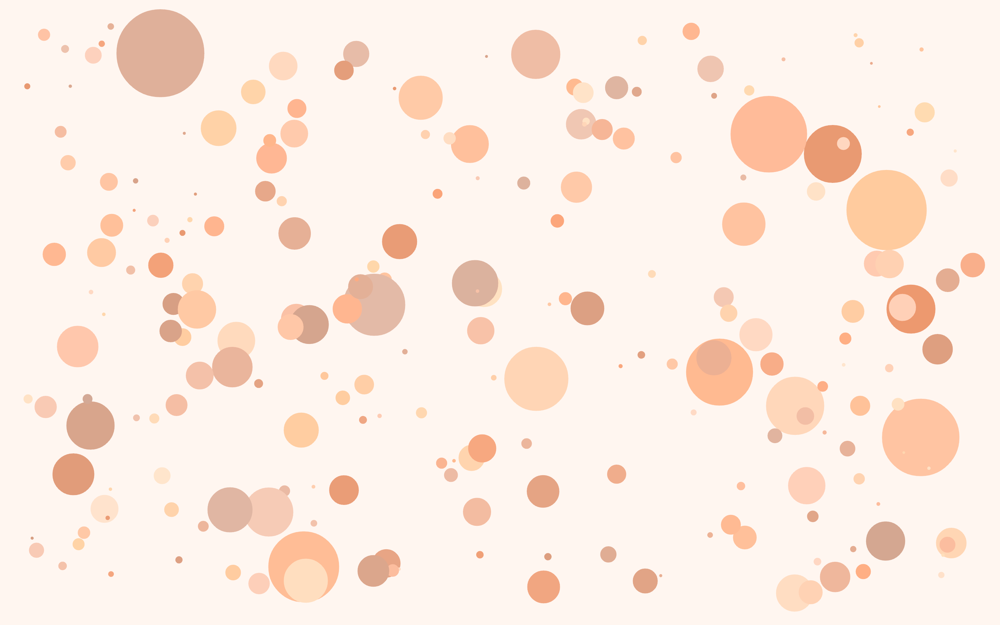
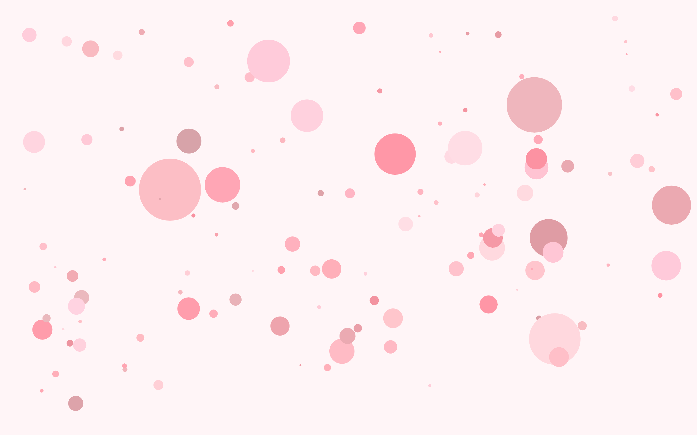
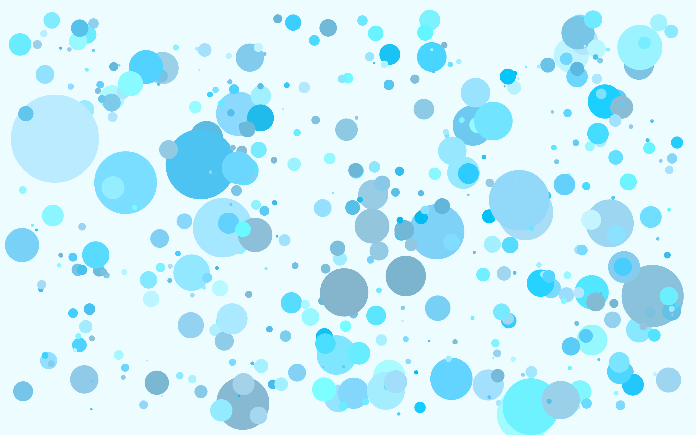

# Rust Creative

Hello! As a full-stack developer deeply ingrained in the Ruby/Python/JS ecosystem, I've always been captivated by the elegance and expressiveness of dynamic languages. They've been my trusting tools for web development, data analysis, ML/AI, etc. However, I've increasingly sensed a boundary to what they have to offer in terms of enhancing my own skills.

I have been meaning to start with Rust for a long time, but never got around to it. This repository is **my attempt to learn Rust, motivated by a blend of my passions: programming and art** - to guide me through the challenging learning curve.

## Why Rust?

Let's bypass the usual praises of Rust's safety and speed. Instead, I want to share what I feel is missing from my current skillset. Although I write code in several dynamic languages - moving from one to another hasn't **significantly** broadened my skills; it's often just a matter of choosing the right tool for a specific job. But the joy of learning something fundamentally new, of expanding my horizons for the sake of growth itself, has been absent for too long.

In earlier days, I dabbled in the rare [Emacs Lisp](https://github.com/nikhgupta/emacs-preamble) and OCAML (while I was working with languages such as Ruby/Python), which proved to be instrumental in shaping my programming skills. However, as time passed, I drifted away from these languages, and a sense of stagnation crept in with the dynamic ones. There's a skill gap I've sensed, a disparity between where I am and where I admire others for being. I'm not just chasing technical proficiency; I'm seeking a transformation that makes me a more rounded, insightful developer.

Learning Rust isn't a magic solution to this skill gap, but it's definitely **a step towards diminishing it**. It's about rekindling my love for the craft, challenging myself, and, in the process, induce self-improvement and the genuine satisfaction that comes from it.

In essence, this journey with Rust is more than just learning a new language; it's about **becoming a better version of myself as a developer**.

## Why creative coding?

This project represents **my journey into Rust, paired with the artistry of creative coding** through [nannou](https://nannou.cc). I believe that the most effective way to master a new programming language is by engaging with projects that ignite your passion. For me, that passion manifests when I see how simple lines of code transform into stunning visual designs. The magic of a little randomness and a set of simple rules evolving into mesmerizing art pieces never fails to inspire me. This same sense of wonder drives my interest in Generative AI, like the open-source Stable Diffusion, where code breathes life into unique creations.

Creative coding, in this sense, is the perfect playground for learning a new language. It marries the joy of learning with the satisfaction of artistic expression. Each commit isn't just about practicing syntax or learning of new concepts; it's about building, experimenting, and refining an environment that's uniquely yours. As you assimilate new concepts, you will find opportunities to weave these into your existing creations, enhancing them with fresh insights and techniques.

This iterative process — where learning intersects with creation — allows for a gradual, enjoyable, and deeply personal exploration of the language. It's a method where art becomes a reflection of progress: as your understanding deepens, your creations evolve. They should attest to your growing skill, transitioning from simple visuals to intricate artforms that have a depth of both beauty and efficiency. I believe that, **through this approach, anyone can not only learn the deeper intricacies of a language but also leave a trail of artwork that charts the journey from novice to adept - showcasing better understanding of the language and performance gains over time.**

## What This Repository Offers?

This repository serves as a living document of my Rust and creative coding journey. Here, you'll find a collection of experiments that I've created as I explore the intricacies of Rust and the capabilities of [nannou](https://nannou.cc).

Each creation (an experiment) within this repository is accompanied by my thought processes, challenges faced, and solutions found. This not only serves to solidify my own understanding but also provides a resource for others who wish to learn alongside me or explore these concepts on their own.

Overtime, I hope that this repository **serves to showcase my knowledge of the versatility and power of Rust in the realm of creative coding**.

## How Someone Can Follow Along?

If you're interested in following along with my journey or starting your own exploration into Rust and creative coding, here are some steps to get started:

- Grok the [book](https://doc.rust-lang.org/book/). At the least, [read](https://doc.rust-lang.org/book/ch03-00-common-programming-concepts.html) [through](https://doc.rust-lang.org/book/ch07-00-managing-growing-projects-with-packages-crates-and-modules.html) [these](https://doc.rust-lang.org/book/ch06-00-enums.html) 4 [sections](https://doc.rust-lang.org/book/ch09-00-error-handling.html).
- Get started with the [nannou tutorials](https://www.guide.nannou.cc/tutorials).
- Practice creating generative art through the [Schotter tutorial](https://github.com/sidwellr/schotter). Do not just read through this tutorial, practice by writing it.
- Try and understand how [Creative Coding Tutorial in Rust](https://dev.to/deciduously/creative-coding-in-rust-with-nannou-1lbl) refactors the initial code and introduces several libraries. You can make analogies by comparing to a dynamic language you know of. This [section](https://doc.rust-lang.org/book/ch10-00-generics.html) in the official Rust book should help.

Once you have completed the steps above, you should be able to traverse the commit history of this repository to follow along. This is how I started with this repository, but you can/should opt for a better path you believe would be more fruitful.

Remember, the goal is not just to learn Rust but to use it as a tool for creative expression and personal growth. Happy coding and creating!

## Screenshots

### E01 - Circles

